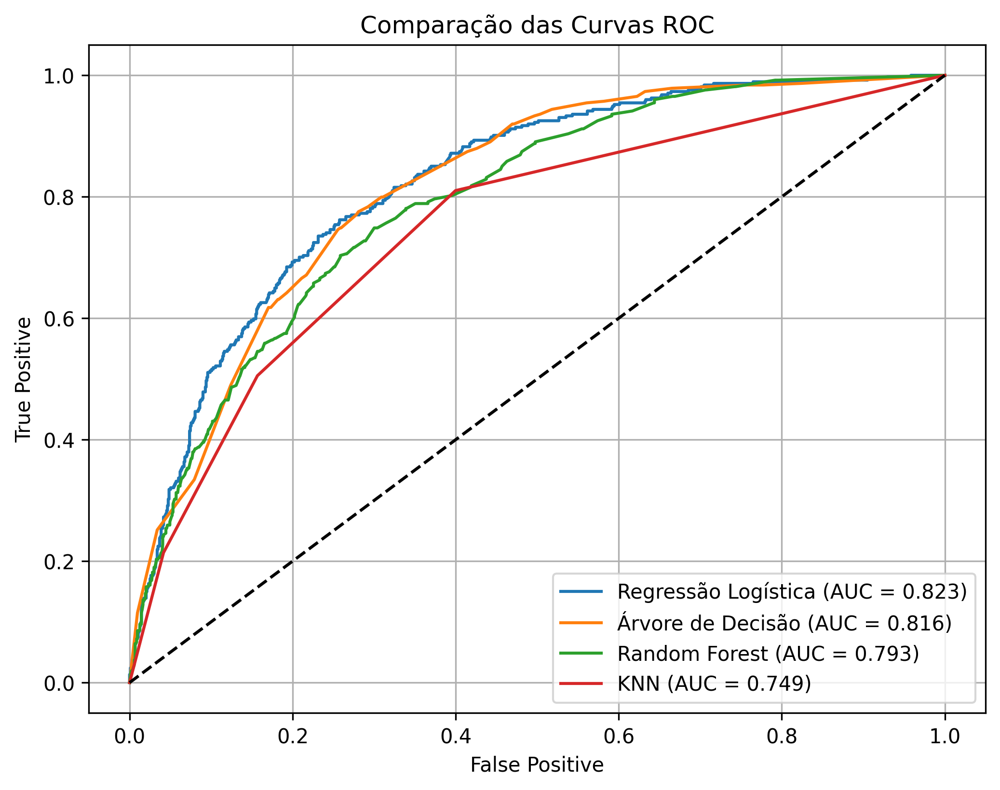
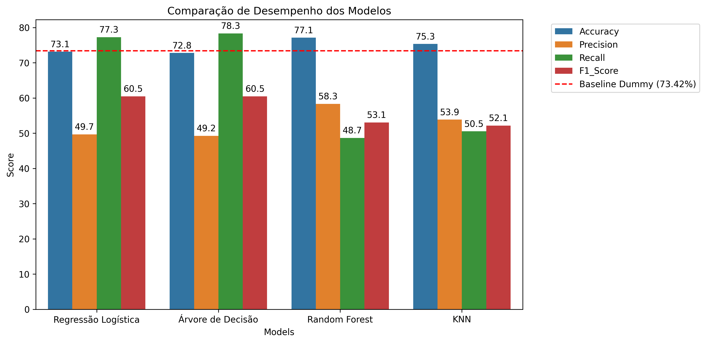
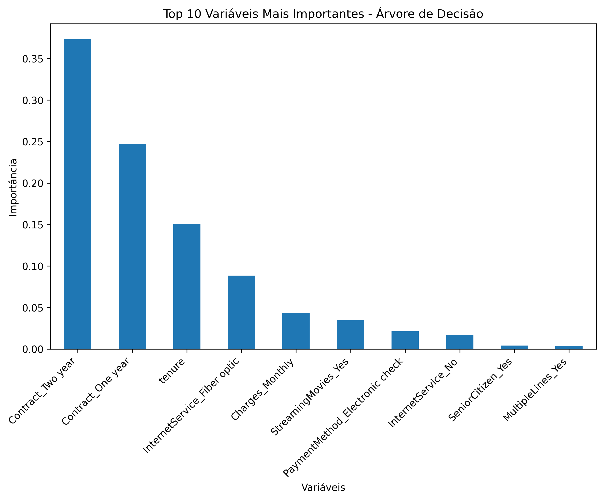
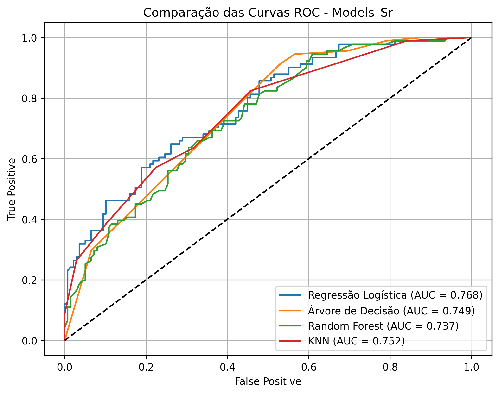
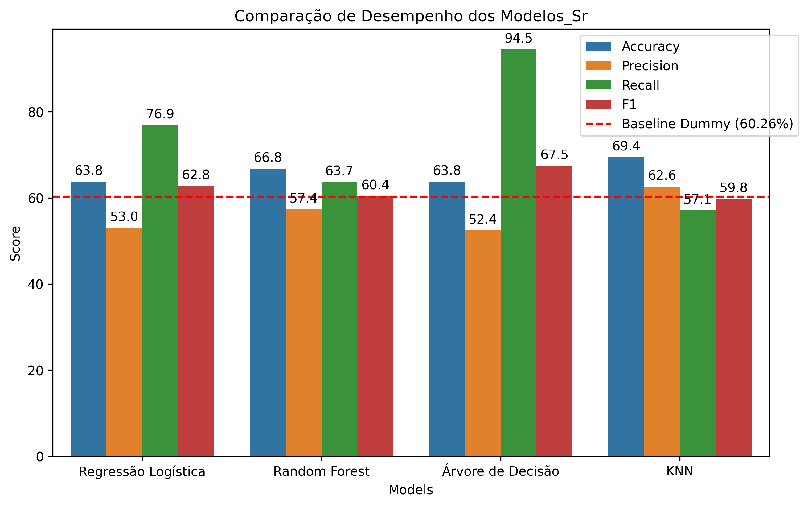
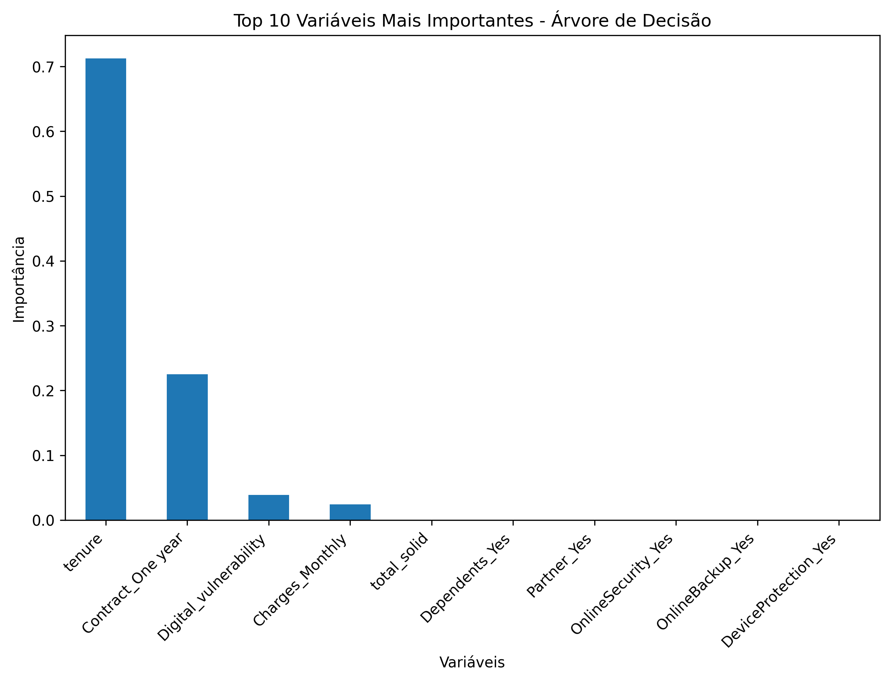

<h1 align="center" style="font-weight: bold;">
  📡 TelecomX: Predição de Churn e Análise de Segmento Sênior
</h1>

<p align="center">
  
  
  
  
  
</p>

<p align="center">
 <a href="#objective">Objetivo</a> • 
 <a href="#modeling">Modelagem</a> •
 <a href="#metrics">Métricas</a> • 
 <a href="#results">Resultados</a> •
 <a href="#insights">Principais Insights</a> • 
 <a href="#techs">Tecnologias</a> • 
 <a href="#structure">Estrutura</a> • 
 <a href="#execute">Como Executar</a> • 
 <a href="#license">Licença</a>
</p>

---

<h2 id="objective"> 🤖 Objetivo</h2>

Este projeto aplica modelos de Machine Learning para prever a rotatividade de clientes (Churn) em uma base de telecomunicações, com um foco analítico especial no comportamento do segmento **Senior Citizen**.

---

<h2 id="modeling"> 🧠 Modelagem Preditiva</h2>

### 🔹 Etapas do Processo

1. Limpeza e preparação dos dados  
2. Feature Engineering  
3. Encoding de variáveis categóricas  
4. Padronização 
5. Separação treino/teste  
6. Treinamento de modelos
7. AValiação e comparação de métricas
8. Escolha do(s) modelos 

### 🔹 Modelos Testados

- Dummy (modelo base - comparativo)
- Regressão Logística  
- Random Forest  
- Decision Tree  
- KNN

---


<h2 id="metrics"> 📏 Métricas Avaliadas</h2>

- Accuracy  
- Precision  
- Recall  
- F1-Score  
- ROC-AUC  
- Matriz de Confusão  

---

<h2 id="results"> 📊 Resultados Obtidos</h2>

### 🌍 Estudo Geral 
Nesta análise, observa-se o comportamento médio de toda a base de clientes da TelecomX.

<p align="center"></p>
<p align="center"></p>
<p align="center"></p>

### 👴 Segmento Sênior (Senior Citizens)
Análise específica focada no comportamento e propensão de churn para clientes acima de 65 anos.

<p align="center"></p>
<p align="center"></p>
<p align="center"></p>

---

<h2 id="insights">📊 Principais Insights</h2>

- O segmento sênior responde por 25,4% de todo o churn da operação (476 de 1.869 casos totais).
- A proporção de churn no grupo sênior é aproximadamente igual à da base geral, indicando que a idade não é o motivador principal, mas sim um subconjunto considerável.
- Em ambas análises,tanto no sentido geral da avaliação do churn como também do subconjunto selecionado de pessoas senior,o modelo que obteve mais destaque,levando em consideração o foco no **Recall** e uma média considerável nas demias métricas,foi o da árvore de decisão.

<h2 id="techs"> 🛠️ Tecnologias Utilizadas</h2>

- Python 3
- Pandas
- Pathlib
- Scikit
- Matplotlib
- Seaborn

---

<h2 id="structure"> 🧩 Estrutura do Projeto</h2>

```
TelecomX_BR_parte2_Predicition
  ├── TelecomX_BR_parte2.ipynb       # Notebook principal com toda a análise
  ├── data-base/              # Database fonte
  ├── images/                 # Principais Gráficos exportados
  ├── LICENSE
  └── README.md
```

---

<h2 id="execute"> 🚀 Como Executar o Projeto</h2>

1. Clone o repositório:

```bash
git clone https://github.com/MiguelLuan/TelecomX_BR_parte2_Prediction.git
```

2. Acesse a pasta do projeto:

```bash
cd TelecomX_BR
```

3. Execute o notebook:

```bash
jupyter notebook TelecomX_BR.ipynb
```

Caso necessário, instale as dependências:

```bash
pip install pandas numpy matplotlib seaborn
```

--- 
## 👨‍💻 Desenvolvedor

| [<br><sub>Miguel Luan</sub>](https://github.com/MiguelLuan) |
| :---: |

---

<h2 id="license"> 📝 Licença </h2>

Este projeto está sob a licença [MIT](https://github.com/MiguelLuan/TelecomX_BR_parte2_Prediction/blob/main/LICENSE).

